# 🎓 Mentoría de Finanzas para Microemprendedores

## 🚀 De la idea al crecimiento sostenible

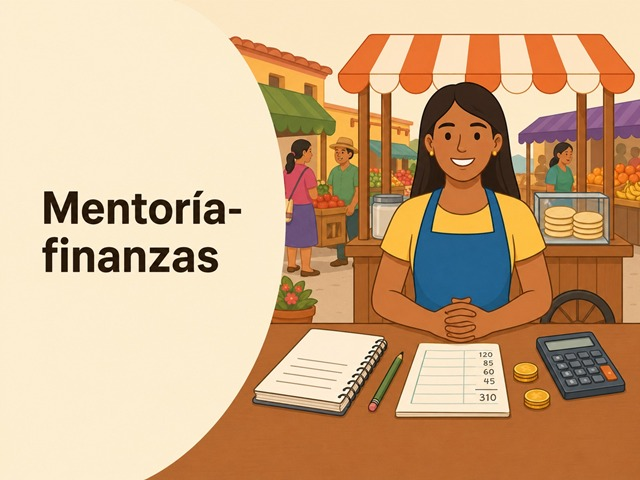

---

## ✅ Lo que aprenderás en este módulo

- 💰 Separar las cuentas personales de las del negocio
- 🧮 Calcular cuánto te cuesta producir
- 🏷️ Definir un precio que sí te deje ganar
- ⚖️ Identificar tu punto de equilibrio
- 📊 Comparar productos y saber cuál te conviene
- 📈 Tomar decisiones de crecimiento con información clara
- 🐷 Crear una política sencilla de ahorro para proteger tu negocio

---

## 🗺️ Tu camino en este módulo

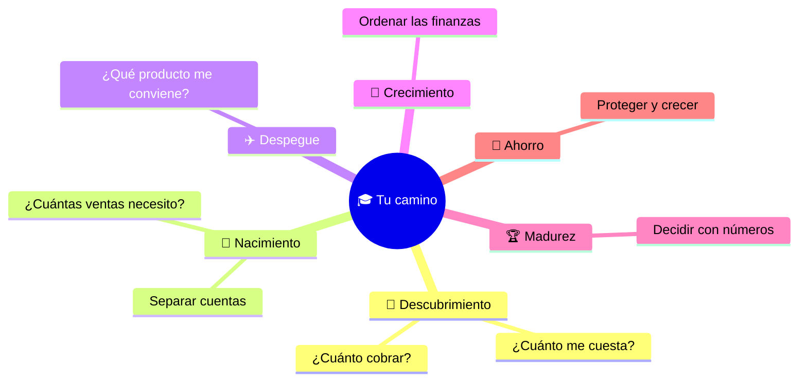

---

# 🗺️ Introducción

## ❓ ¿Por qué importan las finanzas?

Las finanzas son importantes para cuatro cosas:

1. 🆘 **Sobrevivir** — mantener el negocio a flote día a día
2. 🏠 **Sostenerse** — que el negocio sea estable mes a mes
3. 🔭 **Proyectarse** — planear el futuro con claridad
4. 🌱 **Crecer** — escalar sin perder control

---

## ⚠️ Cosas que pasan cuando no se separan las cuentas

Cuando mezclas la plata de la casa con la del negocio:

- 😰 Nunca sabes si ganas o pierdes
- 🕳️ El dinero desaparece y no sabes dónde fue
- 🙈 Tomas decisiones a ciegas
- 🧱 El negocio no puede crecer porque no hay claridad

---

## 📋 ¿Sabías que...?

Según el GEM, las principales causas de fracaso en emprendimientos son:

- 🚫 Limitado acceso a financiamiento
- 📉 Débil formación empresarial
- 🔍 Baja diferenciación y validación de mercado
- 🏪 Sobreoferta en sectores de baja barrera de entrada

**💀 La gestión financiera es la primera causa de cierre.**

---

## 🚨 Caso 1: Emergencia familiar

Juanita vende arepas. Su mamá tuvo un accidente grave y necesita \$2.000.000 urgente. Debe cerrar su negocio por 4 días.

**❓ Preguntas:**

- 💵 ¿Qué dinero tenemos disponible para responder?
- 🤔 ¿Qué hacemos hoy para resolver esto?
- 📉 ¿Cuánto dinero se pierde si el negocio cierra varios días?

---

## 🔍 Caso 2: Vendo, pero no veo la plata

Rosa hace y vende empanadas. Vende todos los días, pero siente que el dinero desaparece.

**❓ Preguntas:**

- 🫣 ¿Dónde está el dinero?
- 🔄 ¿Estoy mezclando gastos personales con gastos del negocio?
- 📝 Si no anoto, ¿cómo sé si gano o pierdo?

---

# 🔎 Etapa 1: Descubrimiento

## 🎯 Objetivo de esta etapa

Entender qué vendes, cuánto te cuesta producir y cómo definir un precio mínimo que te deje ganar.

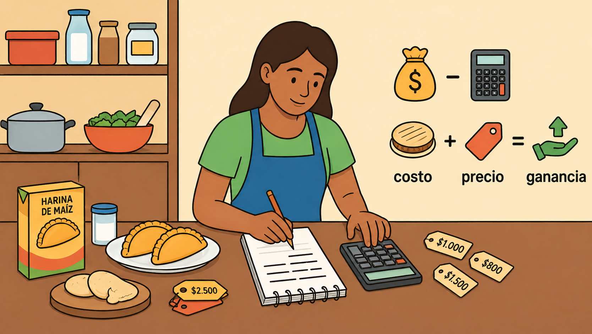

---

## 🗺️ Mapa mental: Descubrimiento

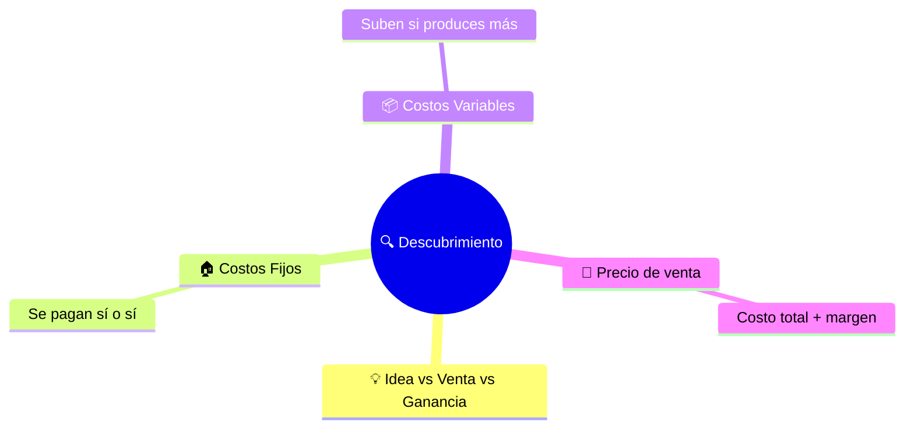

---

## 💡 Idea, Venta y Ganancia

- 💭 **Idea** — Lo que quiero vender. Ejemplo: *"Quiero vender galletas caseras"*
- 🛒 **Venta** — El precio que paga el cliente por cada unidad
- 💵 **Ganancia** — Lo que queda después de pagar todos los costos

> 📌 La ganancia por unidad es lo que en finanzas se llama **"margen"**.

---

## 🏠 Costos Fijos

Son los gastos que se pagan **aunque no se venda nada**.

- 🏢 Arriendo del local o taller
- 💡 Servicios mínimos (luz, agua, gas base)
- 📱 Internet y celular del negocio
- 👷 Salario fijo de ayudante
- 🏥 Seguridad social
- 🔧 Depreciación de equipos

---

## 📦 Costos Variables

Son los gastos que **aumentan o disminuyen según lo que produces**.

- 🥚 Ingredientes por unidad
- 🎁 Empaques (bolsas, cajas, etiquetas)
- 🔥 Gas usado directamente en producción
- 💳 Comisiones por venta
- 👐 Mano de obra directa por unidad

---

## 🍪 Ejemplo: Galletas caseras — Costos fijos mensuales

| Concepto | Valor |
|---|---:|
| Arriendo del pequeño taller | \$600.000 |
| Servicios (luz, agua, gas base) | \$150.000 |
| Internet y celular del negocio | \$50.000 |
| **Total costos fijos** | **\$800.000** |

---

## 🍪 Ejemplo: Galletas caseras — Costo variable por unidad

| Concepto | Valor |
|---|---:|
| Harina, azúcar, mantequilla, chocolate | \$1.200 |
| Empaque (bolsa y etiqueta) | \$300 |
| Gas adicional para hornear | \$200 |
| Mano de obra directa por galleta | \$300 |
| **Total costo variable por galleta** | **\$2.000** |

---

## 🧮 Costo total unitario

Primero responde: **¿Cuántas unidades crees que puedes vender al mes?**

Supongamos 1.000 galletas al mes.

| Concepto | Cálculo | Valor |
|---|---|---:|
| Costo fijo unitario | $\$800.000 \div 1.000$ | \$800 |
| Costo variable unitario | Ingredientes + empaque + gas + MO | \$2.000 |
| **Costo total unitario** | $\$800 + \$2.000$ | **\$2.800** |

> 🚨 Si vendes cada galleta por menos de \$2.800, estás perdiendo plata.

---

## 💲 Definir el precio: método costo + margen

El emprendedor define un margen deseado, por ejemplo **30%**.

$$Precio\ de\ venta = \frac{Costo\ total\ unitario}{1 - margen\ deseado}$$

$$Precio = \frac{\$2.800}{1 - 0{,}30} = \frac{\$2.800}{0{,}70} = \$4.000$$

---

## 📋 Resumen del ejemplo: Galletas

| Concepto | Cálculo | Valor |
|---|---|---:|
| Costos fijos mensuales | Arriendo + servicios + internet | \$800.000 |
| Unidades esperadas al mes | Supuesto del emprendedor | 1.000 |
| Costo fijo unitario | $800.000 \div 1.000$ | \$800 |
| Costo variable unitario | Ingredientes + empaque + gas + MO | \$2.000 |
| Costo total unitario | $800 + 2.000$ | \$2.800 |
| Margen deseado | 30% | 0,30 |
| **Precio de venta sugerido** | $\frac{2.800}{0{,}70}$ | **\$4.000** |
| **Ganancia por unidad** | $4.000 - 2.800$ | **\$1.200** |

---

## 🔑 Mensaje clave

> 🚫 Si vendes por debajo de tu costo total, no estás ganando: estás financiando al cliente.

---

## 🤔 Preguntas para ti

- 💸 ¿Cuánto me cuesta sostener el negocio cada mes?
- 🍪 ¿Cuánto me cuesta producir una unidad?
- ⚖️ ¿Estoy vendiendo por encima o por debajo de mi costo real?
- ✅ ¿Mi precio cubre costos y deja ganancia?

---

# 🐣 Etapa 2: Nacimiento

## 🎯 Objetivo de esta etapa

Separar el dinero personal del dinero del negocio y calcular cuántas ventas necesitas para no perder.

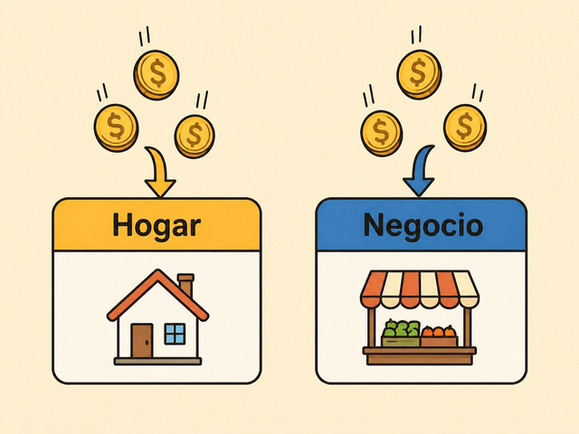

---

## 🗺️ Mapa mental: Nacimiento

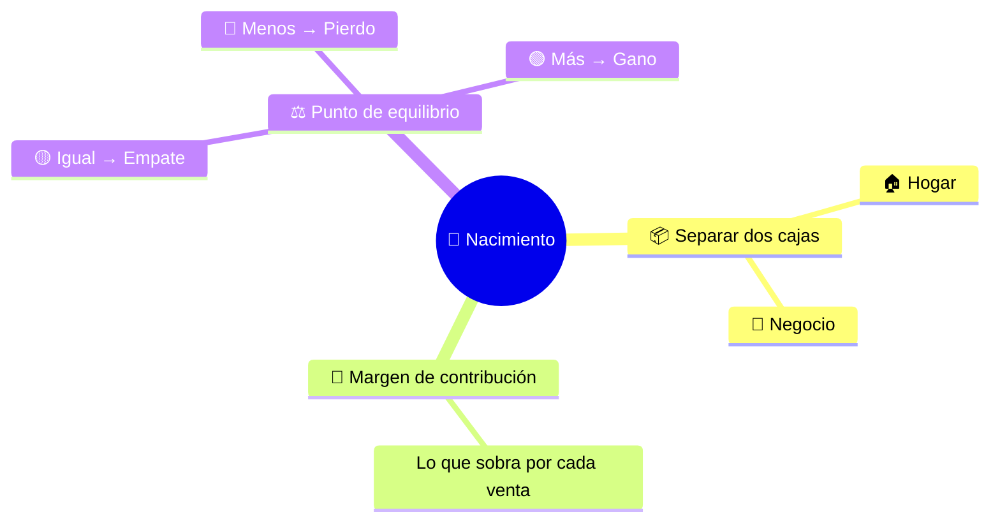

---

## 📦 Dos cajas, dos realidades

El primer paso es separar:

1. 🏠 **Caja del hogar** — finanzas personales
2. 🏪 **Caja del negocio** — finanzas del emprendimiento

> 📌 Mientras uses la misma plata para el mercado de la casa y para comprar insumos, nunca sabrás si el negocio gana o pierde.

---

## 🎮 Actividad: Las dos cajas

El facilitador menciona movimientos. Tú decides a qué caja van:

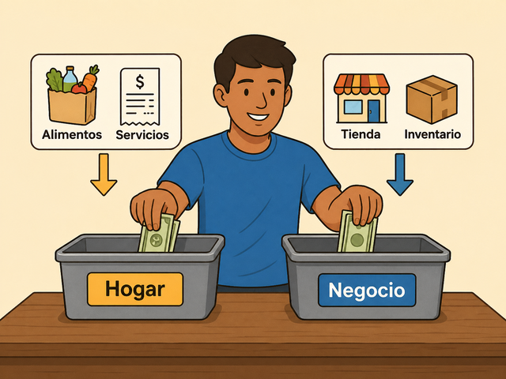

| Movimiento | ¿Caja personal o del negocio? |
|---|---|
| 🛒 Compra de mercado | |
| 🏠 Pago de arriendo de la casa | |
| 💰 Venta de productos | |
| 📦 Compra de materia prima | |
| 💡 Pago de servicios del negocio | |
| 🚌 Transporte del colegio de los niños | |
| 👤 Sueldo del emprendedor | |

---

## 👤 El sueldo emprendedor

El dinero del negocio **no es automáticamente dinero personal**.

- 💵 Define un sueldo o retiro controlado
- 📝 Regístralo como un gasto del negocio
- 🚫 No saques dinero de la caja sin control

Si sacas plata "a la loca" para gastos personales, esa plata no es ganancia: es un retiro no registrado que hace que la caja nunca alcance.

---

## 📐 Margen de contribución

Es lo que queda de cada venta **después de pagar solo los costos variables** 🎯

Ese dinero ayuda a pagar los costos fijos y luego se convierte en ganancia.

$$Margen\ de\ contribución = Precio\ de\ venta - Costo\ variable\ unitario$$

---

## 🍪 Ejemplo: Margen de contribución con galletas

| Concepto | Valor |
|---|---:|
| Precio de venta por galleta | \$4.000 |
| Costo variable por galleta | \$2.000 |
| **Margen de contribución** | **$MC = \$4.000 - \$2.000 = \$2.000$** |

> 📌 De cada galleta que vendes, \$2.000 pagan ingredientes y costos variables, y \$2.000 ayudan a pagar el arriendo, los servicios y tu ganancia.

---

## ⚖️ Punto de equilibrio

Es la cantidad de ventas donde el negocio **no gana ni pierde** 🎯

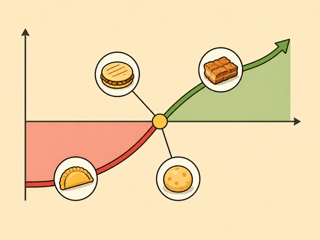

- 🔴 Si vende menos: **pierde dinero**
- 🟡 Si vende exacto: **no gana ni pierde**
- 🟢 Si vende más: **empieza a ganar**

$$Punto\ de\ equilibrio\ (unidades) = \frac{Costos\ fijos}{Margen\ de\ contribución\ unitario}$$

---

## 🍪 Ejemplo: Punto de equilibrio con galletas

| Concepto | Valor |
|---|---:|
| Precio de venta por galleta | \$4.000 |
| Costo variable por galleta | \$2.000 |
| Margen de contribución | \$2.000 |
| Costos fijos mensuales | \$800.000 |
| **Punto de equilibrio** | **400 galletas** |

$$PE = \frac{\$800.000}{\$2.000} = 400\ galletas$$

---

## 📣 Tres mensajes clave

- 🔴 Si vendes **menos de 400 galletas**, el negocio pierde
- 🟡 Si vendes **exactamente 400**, no ganas ni pierdes
- 🟢 A partir de la **galleta 401** empieza la ganancia real

---

## 🤔 Preguntas para ti

- 📊 ¿Cuántas unidades vendo al mes?
- ⚖️ ¿Estoy por debajo o por encima de mi punto de equilibrio?
- 💸 ¿Cuánto saco del negocio para uso personal?
- 📝 ¿Ese retiro está registrado como sueldo?

---

# ✈️ Etapa 3: Despegue

## 🎯 Objetivo de esta etapa

Comparar productos, saber cuáles convienen más y calcular el punto de equilibrio cuando vendes varios productos.

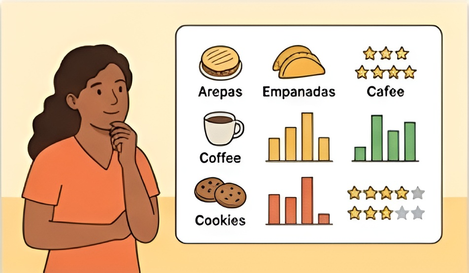

---

## 🗺️ Mapa mental: Despegue

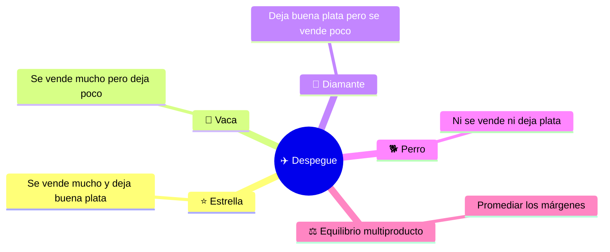

---

## 🛒 El negocio ya tiene más de un producto

Ahora necesitas responder:

- 📈 ¿Qué producto se vende más?
- 💰 ¿Qué producto deja más margen?
- ⏰ ¿Qué producto consume tiempo y no aporta?
- 🚀 ¿Qué producto debería impulsar?

---

## 📊 Matriz de clasificación de productos

Usamos dos ejes simples:

- 📈 **Popularidad** — ¿Se vende mucho o poco?
- 💰 **Rentabilidad** — ¿Deja buena ganancia o poca?

---

## 🏷️ Cuatro categorías

| Categoría | Popularidad | Rentabilidad | Qué hacer |
|---|---|---|---|
| ⭐ **Estrella** | Alta | Alta | Cuidarlo e impulsarlo |
| 🐄 **Vaca** | Alta | Baja | Mantener volumen, ayuda a pagar las cuentas |
| 💎 **Diamante** | Baja | Alta | Hacer pruebas, promoción y seguimiento |
| 🐕 **Perro** | Baja | Baja | Revisar, transformar o eliminar |

---

## 🥟 Ejemplo: Clasificación de los productos de Conchi

| Producto | Margen de contribución | Unidades vendidas al mes | Categoría |
|---|---:|---:|---|
| 🥟 Arepa de huevo | \$1.500 | 720 | ⭐ Estrella |
| 🥔 Papa rellena | \$1.000 | 480 | 🐄 Vaca / 🐕 Perro |
| 🥟 Empanada | \$900 | 960 | 🐄 Vaca |

---

## ⚖️ Punto de equilibrio multiproducto

Cuando vendes varios productos, no basta con calcular el de uno solo.

Se necesita un **margen de contribución promedio ponderado** según la participación de cada producto.

$$Participación = \frac{Unidades\ del\ producto}{Unidades\ totales}$$

$$Margen\ ponderado = \sum_{i=1}^{n} \left( Margen_i \times Participación_i \right)$$

---

## 🥟 Ejemplo: Cálculo paso a paso (Conchi)

**Ventas totales:** $720 + 480 + 960 = 2.160$ unidades

| Producto | Margen contribución | Participación | Aporte ponderado |
|---|---:|---:|---:|
| 🥟 Arepa de huevo | \$1.500 | 33,3% | \$499,5 |
| 🥔 Papa rellena | \$1.000 | 22,2% | \$222 |
| 🥟 Empanada | \$900 | 44,5% | \$400,5 |
| **Total ponderado** | | | **\$1.122** |

---

## 🥟 Punto de equilibrio multiproducto de Conchi

Costos fijos: **\$910.000**

$$PE_{total} = \frac{\$910.000}{\$1.122} \approx 811\ unidades$$

Distribución por producto:

| Producto | Participación | Punto de equilibrio aproximado |
|---|---:|---:|
| 🥟 Arepa de huevo | 33,3% | 271 unidades |
| 🥔 Papa rellena | 22,2% | 181 unidades |
| 🥟 Empanada | 44,5% | 361 unidades |

---

## 🚦 Diagnóstico: Semáforo de ventas

Compara tus ventas reales contra el punto de equilibrio:

- 🔴 **Rojo** — Por debajo del punto de equilibrio
- 🟡 **Amarillo** — Cerca del punto de equilibrio
- 🟢 **Verde** — Por encima del punto de equilibrio

> 💡 Divide tu punto de equilibrio mensual entre 4 para tener la meta semanal. Luego compara con tus ventas reales de las últimas 12 semanas.

---

## 🔑 Mensaje clave

> 🎯 No todo lo que vendo me conviene por igual. Algunos productos pagan las cuentas, otros generan crecimiento y otros solo ocupan tiempo.

---

## 🤔 Preguntas para ti

- ⭐ ¿Cuál producto es mi estrella?
- 🐄 ¿Cuál producto es mi vaca?
- 🐕 ¿Cuál producto debería revisar?
- ⚖️ ¿Estoy alcanzando el punto de equilibrio total?
- 🚀 ¿Qué producto debo impulsar esta semana?

---

# 🌱 Etapa 4: Crecimiento

## 🎯 Objetivo de esta etapa

Ordenar la estructura financiera del negocio para crecer sin perder control.

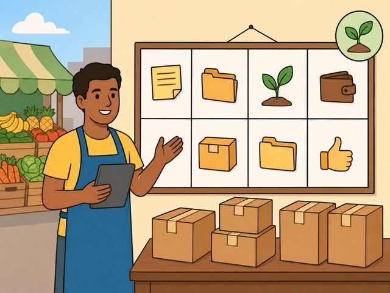

---

## 🗺️ Mapa mental: Crecimiento

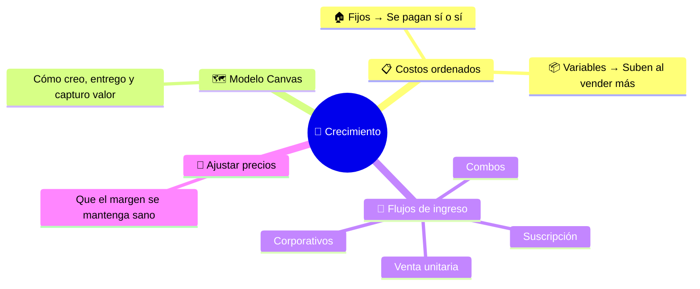

---

## 📈 Crecer no es solo vender más

El objetivo es crecer con:

- 🧮 Costos claros
- 🏷️ Precios revisados
- 💰 Márgenes sanos
- 💸 Flujos de ingreso priorizados
- 🏗️ Modelo de negocio sostenible

---

## 📋 Tabla estructurada de costos

| Tipo | Categoría | Descripción | Ejemplo |
|---|---|---|---:|
| 🏠 Fijo | Arriendo taller | Local de producción o punto de venta | \$700.000 |
| 💡 Fijo | Servicios | Luz, agua, gas base | \$200.000 |
| 📱 Fijo | Internet y software | WhatsApp Business, pagos, suscripciones | \$80.000 |
| 👷 Fijo | Sueldo ayudante | Apoyo fijo de producción o venta | \$600.000 |
| 📢 Fijo | Marketing base | Publicidad mensual constante | \$200.000 |
| 🥚 Variable | Materia prima producto A | Ingredientes por unidad | \$2.000 / u |
| 🥚 Variable | Materia prima producto B | Ingredientes premium por unidad | \$3.000 / u |
| 🎁 Variable | Empaques | Bolsas, cajas, stickers | \$300 / u |
| 🚚 Variable | Reparto | Envíos por pedido | \$4.000 / pedido |
| 💳 Variable | Comisiones | Pasarela o plataformas | 5% de la venta |

---

## 🗺️ Modelo Canvas: Los 9 bloques

El Canvas ayuda a entender cómo el negocio crea, entrega y captura valor.

1. 👥 **Segmentos de clientes** — ¿Para quién creamos valor?
2. 🎁 **Propuesta de valor** — ¿Qué problema resolvemos?
3. 🚚 **Canales** — ¿Cómo entregamos la propuesta?
4. 🤝 **Relaciones con clientes** — ¿Qué vínculo establecemos?
5. 💰 **Flujos de ingresos** — ¿Cómo captamos valor económico?
6. 🏗️ **Recursos clave** — ¿Qué activos son indispensables?
7. ⚙️ **Actividades clave** — ¿Qué acciones requiere el negocio?
8. 🤝 **Asociaciones clave** — ¿Qué socios facilitan el modelo?
9. 💸 **Estructura de costos** — ¿Cuáles son los gastos principales?

---

## 💸 Flujos de ingreso del negocio

| Flujo de ingreso | Segmento cliente | Propuesta de valor | Precio base | Margen estimado | Frecuencia | Prioridad |
|---|---|---|---|---|---|---|
| 🛒 Venta unitaria | Vecinos / paso a paso | Producto fresco inmediato | \$4.500 A / \$6.500 B | Medio | Diario | Alta |
| 📦 Combos | Familias y reuniones | Ahorro por volumen | \$24.000 caja de 6 | Alto | Fines de semana | Alta |
| 🏢 Corporativos / eventos | Empresas, colegios | Grandes cantidades, personalización | Cotización | Alto si se planifica | Mensual / evento | Media-Alta |
| 🔄 Suscripción mensual | Clientes frecuentes | Caja mensual a domicilio | \$80.000 mensual | Alto si hay volumen | Mensual | Estrategia futura |

---

## 📝 Plantilla de ajuste de precios

✏️ Completa con los datos de tu negocio:

| Producto o línea | Precio actual | Costo variable | Margen actual | Precio sugerido | Nuevo margen |
|---|---:|---:|---:|---:|---:|
| Producto A | | | | | |
| Producto B | | | | | |
| Combo | | | | | |
| Suscripción | | | | | |

---

## 🔑 Mensaje clave

> 🎯 Crecer no es vender más a cualquier costo. Crecer es vender mejor, con márgenes claros y costos controlados.

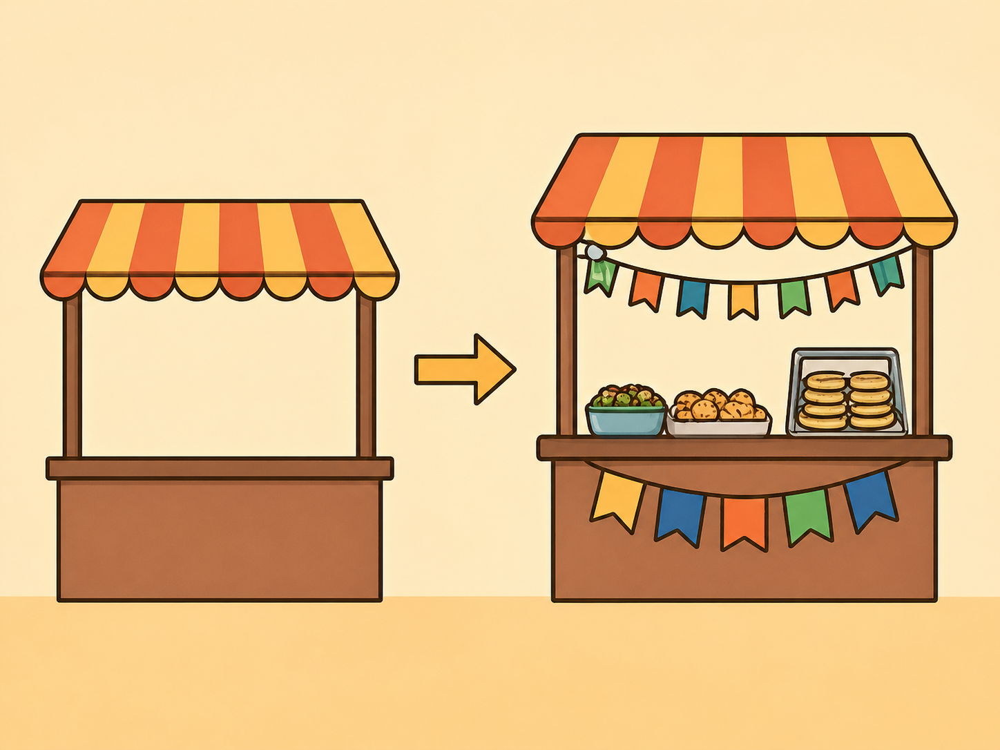

---

## 🤔 Preguntas para ti

- 📈 ¿Qué costos aumentan cuando vendo más?
- 🏠 ¿Qué costos pago aunque no venda?
- 💰 ¿Qué flujo de ingreso deja mejor margen?
- 🔄 ¿Qué flujo de ingreso puede repetirse cada mes?
- 🏗️ ¿Mi estructura de costos soporta mi crecimiento?

---

# 🏆 Etapa 5: Madurez

## 🎯 Objetivo de esta etapa

Tomar decisiones estratégicas con base en rentabilidad, costos y punto de equilibrio actualizado.

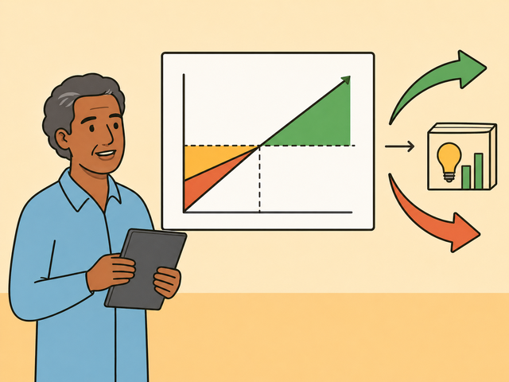

---

## 🗺️ Mapa mental: Madurez

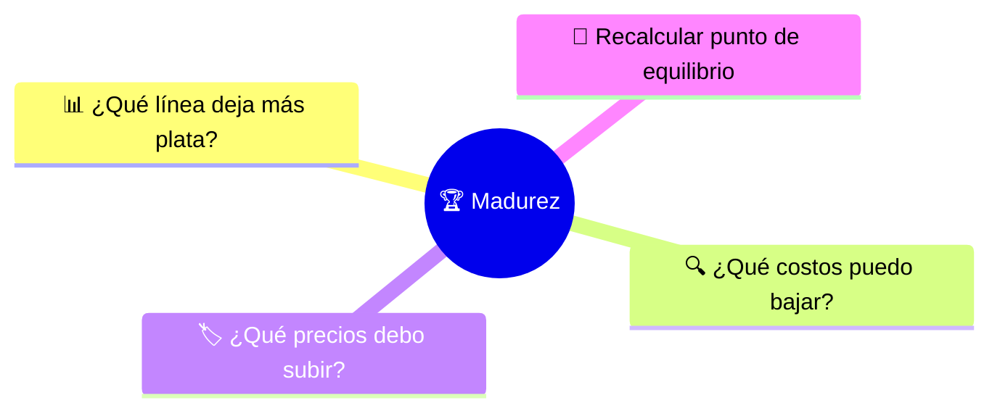

---

## 🔍 Más allá de las ventas totales

En madurez no basta con mirar las ventas totales. Necesitas analizar:

- 📊 ¿Qué línea de negocio vende más?
- 💰 ¿Qué línea deja más margen?
- 💸 ¿Qué línea consume más costos?
- 🤔 ¿Qué línea debería crecer, ajustarse o cerrarse?

---

## 📊 Análisis de rentabilidad por línea de negocio

| Línea de negocio | Ventas | Costo variable total | Margen de contribución total | Margen % |
|---|---:|---:|---:|---:|
| 🛒 Venta unitaria tienda | \$3.000.000 | \$1.500.000 | \$1.500.000 | 50% |
| 📦 Combos | \$4.000.000 | \$1.800.000 | \$2.200.000 | 55% |
| 🏢 Pedidos corporativos | \$2.500.000 | \$1.400.000 | \$1.100.000 | 44% |
| 🔄 Suscripción mensual | \$1.500.000 | \$700.000 | \$800.000 | 53% |

---

## 📖 Lectura clave

Una línea puede vender mucho, pero no necesariamente ser la más rentable.

El objetivo es asignar más recursos a las líneas con:

- 💰 **Alto margen**
- 📈 **Buen volumen**
- 🔄 **Recurrencia**
- 😌 **Menor desgaste operativo**

---

## 🔍 Revisión de la estructura de costos

| Bloque Canvas | Elemento a revisar | Acción posible |
|---|---|---|
| 🎁 Propuesta de valor | Variedad, calidad, empaque | Mantener lo clave, simplificar lo que no agrega valor |
| 👥 Segmentos de cliente | Tienda, corporativo, suscripción | Priorizar clientes con mejor margen y recurrencia |
| 🚚 Canales | Tienda, domicilios, redes | Medir costo de cada canal vs ventas generadas |
| 💸 Estructura de costos | Fijos y variables | Reducir desperdicios, convertir fijos en variables si conviene |
| 💰 Fuentes de ingreso | Unitaria, combos, eventos, suscripción | Impulsar las líneas más rentables |

---

## 🔄 El punto de equilibrio se recalcula

El punto de equilibrio **no se calcula una sola vez** 🔄

Debe recalcularse cuando cambian:

- 🏷️ Los precios
- 📦 Los costos variables
- 🏠 Los costos fijos
- 📊 La mezcla de ventas
- 🛒 Las líneas de negocio

---

## 💲 Nuevos precios y márgenes

| Línea de negocio | Nuevo precio promedio | Nuevo costo variable | Nuevo margen de contribución | Nuevo margen % |
|---|---:|---:|---:|---:|
| 🛒 Venta unitaria | \$4.700 | \$2.100 | \$2.600 | 55% |
| 📦 Combos | \$26.000 | \$11.000 | \$15.000 | 58% |
| 🏢 Corporativos | Cotización | Depende del pedido | Analizar caso a caso | — |
| 🔄 Suscripción mensual | \$85.000 | \$35.000 | \$50.000 | 59% |

---

## 🏠 Costos fijos actualizados

| Concepto fijo | Valor mensual |
|---|---:|
| Arriendo y servicios | \$850.000 |
| Sueldo ayudante y apoyo extra | \$700.000 |
| Marketing y plataformas | \$250.000 |
| Otros fijos | \$200.000 |
| **Total costos fijos** | **\$2.000.000** |

---

## ⚖️ Nuevo punto de equilibrio global

**Paso 1:** Definir mezcla objetivo de ventas 🎯

- 50% combos
- 30% venta unitaria
- 20% suscripción

**Paso 2:** Calcular margen ponderado 🧮

$$MP = (MC_{combos} \times 0{,}50) + (MC_{unitaria} \times 0{,}30) + (MC_{suscripción} \times 0{,}20)$$

**Paso 3:** Calcular nuevo punto de equilibrio 🎯

$$PE_{nuevo} = \frac{Costos\ fijos\ actualizados}{Margen\ ponderado\ actualizado}$$

---

## 🔑 Mensaje clave

> 🔄 El punto de equilibrio no se calcula una sola vez. Se recalcula cada vez que cambian los precios, los costos o la mezcla de ventas.

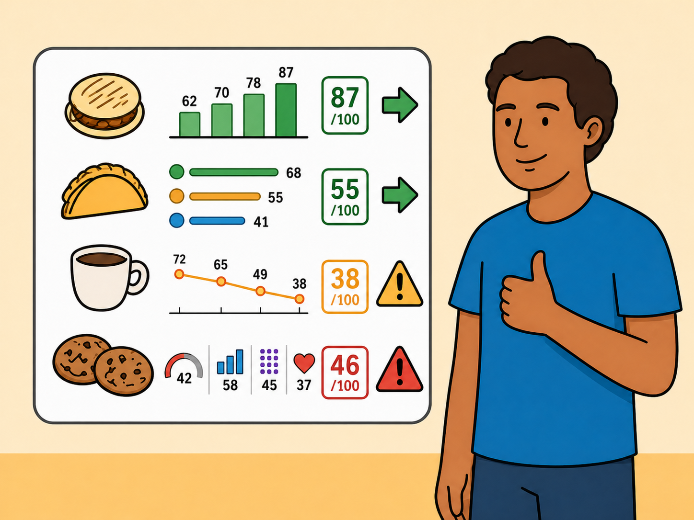

---

## 🤔 Preguntas para ti

- 💰 ¿Qué línea de negocio sostiene realmente mi utilidad?
- 📦 ¿Qué línea vendo mucho, pero me deja poco?
- 💸 ¿Qué costos debo renegociar?
- 🏷️ ¿Qué precios debo revisar?
- 🎯 ¿Cuál es mi nuevo mínimo saludable de ventas?

---

# 🐷 Bonus: Política de Ahorro Inteligente

## 🎯 Objetivo

Instalar una práctica sencilla de ahorro operativo para proteger y hacer crecer el negocio.

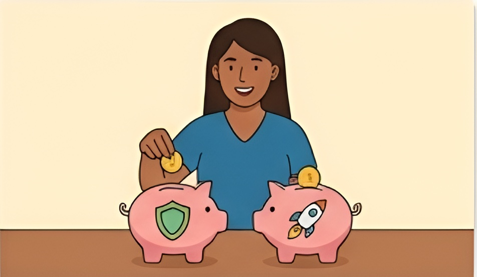

---

## 🗺️ Mapa mental: Ahorro Inteligente

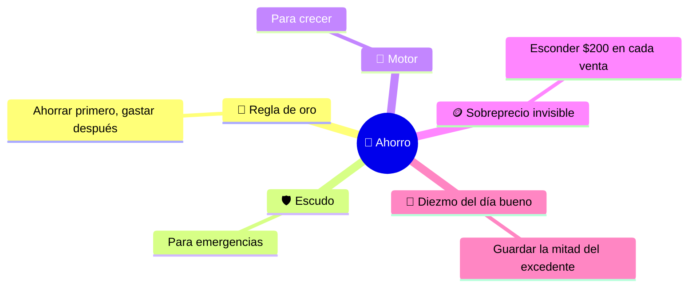

---

## 🥇 Regla de oro

> 💡 No se ahorra lo que sobra, porque casi nunca sobra. El ahorro debe convertirse en un gasto obligatorio diario del negocio.

- 🔒 El ahorro no se toca salvo emergencia del negocio
- 🚫 No es para paseos, ropa ni gastos personales
- 🌱 Se usa para proteger el negocio o hacerlo crecer
- ⚡ **Se separa antes de gastar**

---

## 🛡️ Fondo de emergencia: El Escudo

Protege el negocio cuando ocurre algo inesperado.

- 🔧 Se daña una nevera o un equipo
- 🤒 Hay enfermedad
- 🌧️ Llueve varios días y bajan las ventas
- 📈 Sube de golpe el precio de un insumo
- 🚫 Se debe cerrar unos días

---

## 🚀 Fondo de impulso: El Motor

Sirve para crecer.

- 🏪 Comprar una vitrina o equipo nuevo
- 📦 Comprar insumos por bulto (más barato)
- 💳 Mandar a hacer tarjetas o mejorar empaques
- 📚 Pagar un curso de formación
- 📢 Invertir en publicidad

---

## 🪙 Estrategia 1: El sobreprecio invisible

Separar una pequeña parte de cada venta como ahorro.

**Ejemplo:** Si una empanada se vende a \$3.000, internamente se registra como \$2.800. Los \$200 van directo al ahorro.

Si se venden 50 empanadas al día:

$$Ahorro\ diario = \$200 \times 50 = \$10.000$$

$$Ahorro\ mensual = \$10.000 \times 30 = \$300.000$$

---

## 📅 Estrategia 2: El diezmo del día bueno

En negocios donde las ventas cambian mucho de un día a otro.

**Regla:** Si la venta del día supera el punto de equilibrio diario, se guarda el 50% del excedente.

$$Excedente = Venta\ del\ día - Meta\ del\ día$$

$$Ahorro = Excedente \times 0{,}50$$

| Concepto | Valor |
|---|---:|
| Venta del día | \$200.000 |
| Meta del día | \$150.000 |
| Excedente | $\$200.000 - \$150.000 = \$50.000$ |
| **Ahorro** | **$\$50.000 \times 0{,}50 = \$25.000$** |

---

## 🧱 Compromiso: Mi primer ladrillo

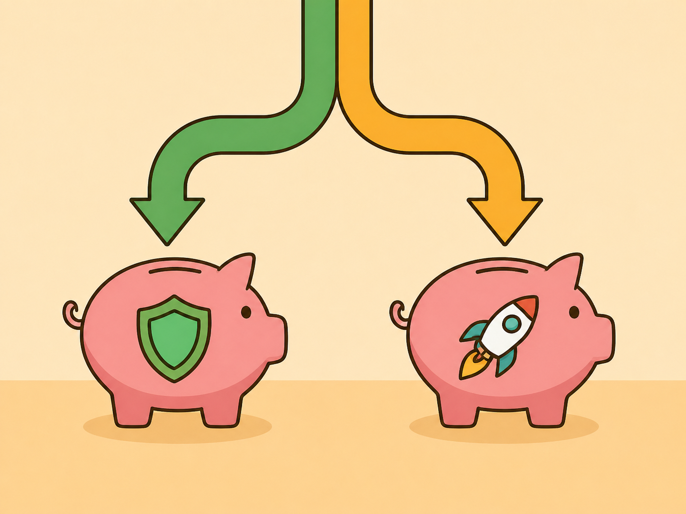

> 📝 Me comprometo a separar **\$_____ diarios** por producto antes de pagar cualquier otra cosa.
>
> 🛡️ La mitad irá a mi tranquilidad: **Escudo**.
>
> 🚀 La mitad irá a mi crecimiento: **Motor**.

---

# 🎓 Cierre reflexivo

## ❓ Preguntas finales

- 📚 ¿Qué aprendí hoy?
- 🛠️ ¿Qué aplicaré en mi emprendimiento?
- 😮 ¿Qué fue lo que más me sorprendió?
- 📋 ¿Qué decisión financiera debo tomar esta semana?
- ✂️ ¿Qué gasto debo separar mejor?
- 🔍 ¿Qué producto debo revisar?
- ⚖️ ¿Cuál es mi punto de equilibrio?
- 🌅 ¿Qué hábito financiero empiezo desde mañana?

---

## 🗣️ Define en una palabra

> 💬 Define en una palabra lo que fue para ti esta mentoría de finanzas.

---

## 📐 Fórmulas clave del módulo

| Fórmula | Cálculo |
|---|---|
| 💲 Costo total unitario | $CT_u = CF_u + CV_u$ |
| 🏷️ Precio de venta | $PV = \frac{CT_u}{1 - m}$ |
| 📐 Margen de contribución | $MC = PV - CV_u$ |
| ⚖️ Punto de equilibrio (unidades) | $PE_u = \frac{CF}{MC}$ |
| 💵 Punto de equilibrio (pesos) | $PE_s = PE_u \times PV$ |
| 📊 Participación por producto | $p_i = \frac{Unidades_i}{Unidades_{totales}}$ |
| 📊 Margen ponderado (multiproducto) | $MP = \sum_{i=1}^{n}(MC_i \times p_i)$ |
| ⚖️ P.E. multiproducto | $PE_{multi} = \frac{CF}{MP}$ |
| 📅 Meta semanal | $Meta_{sem} = \frac{Meta_{mes}}{4}$ |
